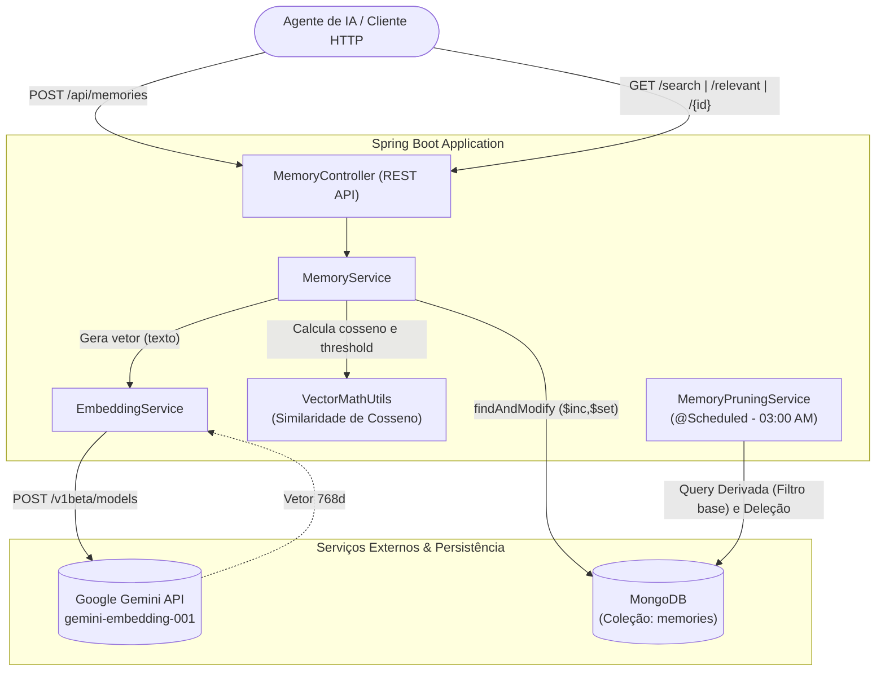

# 🧠 Memora — API de Memória Semântica com IA

> Um serviço de backend em **Java + Spring Boot** que provê memória semântica vetorial de longo prazo para agentes e assistentes de Inteligência Artificial, integrando embeddings vetoriais com relevância cognitiva dinâmica.

Modelos de linguagem (LLMs) são naturalmente *stateless*: esquecem o contexto assim que a janela de conversa se encerra. Abordagens ingênuas de histórico (como reenviar todo o chat concatenado) esbarram rapidamente em limites de contexto, custos elevados de tokens e latência proibitiva.

O **Memora** atua como um córtex de memória externa, priorizando as memórias mais relevantes através de orquestração cognitiva no backend em vez de sobrecarregar o modelo com informação desnecessária.

---

## ✨ Funcionalidades

- 📥 **Vetorização em Tempo Real:** Conversão de textos em embeddings usando a API do Google Gemini (`gemini-embedding-001`).
- 🔍 **Busca Semântica Adaptativa:** Filtro vetorial por similaridade de cosseno com *Threshold Dinâmico* para mitigar falsos positivos.
- 🧮 **Score de Relevância Normalizado:** Cálculo contínuo unindo importância, recência com decaimento exponencial e frequência sublinear.
- ⚡ **Concorrência Atômica:** Atualizações de contadores e acesso via `$inc` e `$set` diretos no MongoDB, sem *race conditions*.
- 🧹 **Esquecimento Biológico (Pruning):** Rotina assíncrona diária (`@Scheduled`) delegada ao banco para limpar memórias defasadas e inúteis.
- 🐳 **Pronto para Produção:** Containerizado com Docker, testes unitários (Mockito) e Integração Contínua via GitHub Actions.

---

## 🏗️ Arquitetura do Sistema



---

## 🔬 Engenharia & Algoritmos

### 1. Busca Semântica com Threshold Dinâmico

Em vez de aplicar uma linha de corte rígida que deixaria passar ruídos, o motor vetorial calcula a similaridade de cosseno e aplica uma régua dinâmica com base no melhor resultado encontrado:

$$\text{dynamicThreshold} = \max(\text{minSimilarity}, \text{maxScore} - 0.08)$$

### 2. Score de Relevância Cognitiva Normalizado

O cálculo de relevância é estritamente balanceado no intervalo $[0.0, 1.0]$, combinando as seguintes dimensões:

$$\text{Score} = (0.40 \cdot S_{\text{importância}}) + (0.35 \cdot S_{\text{recência}}) + (0.25 \cdot S_{\text{frequência}})$$

* **Decaimento Exponencial Contínuo ($S_{\text{recência}}$):** Baseado no tempo decorrido em horas ($t$) desde o último acesso, com meia-vida ($t_{1/2}$) de 72 horas. Evita degraus abruptos.

$$S_{\text{recência}} = e^{-\lambda \cdot t}$$


* **Frequência Sublinear Amortecida ($S_{\text{frequência}}$):** Evita que dezenas de consultas a uma memória trivial esmaguem informações vitais, usando logaritmo natural com saturação em 50 acessos.

$$S_{\text{frequência}} = \min\left(1.0, \frac{\ln(\text{accessCount} + 1)}{\ln(50 + 1)}\right)$$


### 3. Mecanismo de Esquecimento (Memory Pruning)

Uma rotina disparada diariamente às 03:00 am aplica uma limpeza de dados em duas vias (Banco + Aplicação) baseada em:

1. **Baixa Importância:** Nota igual ou inferior a 3.
2. **Inatividade Prolongada:** Sem acesso há mais de 30 dias.
3. **Score Residual:** Relevância final inferior a 0.25.

---

## 🚀 Como Executar

### Pré-requisitos

* **Docker** e **Docker Compose**.
* Uma chave válida da API do Google AI Studio.

### Configuração

1. Clone o repositório:

```bash
git clone [https://github.com/ElissonDouglas/Memora.git](https://github.com/ElissonDouglas/Memora.git)
cd Memora

```

2. Crie um arquivo `.env` na raiz do projeto e insira sua chave do Gemini:

```env
GEMINI_API_KEY=sua_chave_do_google_ai_studio_aqui

```

3. Suba os containers da API e do MongoDB:

```bash
docker compose up -d --build

```

A API estará acessível em `http://localhost:8080`.

### Executando Testes Locais

```bash
./mvnw clean test

```

---

## 📡 Principais Endpoints

| Método | Endpoint | Descrição |
| --- | --- | --- |
| `POST` | `/api/memories` | Cria memória e gera o embedding via Gemini |
| `GET` | `/api/memories/user/{userId}/search` | Busca semântica vetorial `?query=...` com threshold dinâmico |
| `GET` | `/api/memories/{userId}/relevant` | Retorna memórias ranqueadas pelo score cognitivo $[0.0, 1.0]$ |
| `GET` | `/api/memories/{id}` | Busca isolada que dispara incremento atômico de acessos |
| `DELETE` | `/api/memories/{id}` | Remove uma memória específica manualmente |

---

## 🗺️ Roadmap / Próximos Passos

* [ ] **Autenticação:** Proteger endpoints e isolar inquilinos (Multi-tenant) com Spring Security e JWT.
* [ ] **Documentação Interativa:** Interface visual com OpenAPI/Swagger (`springdoc-openapi`).
* [ ] **Escala de Dados:** Migrar a similaridade de cosseno em memória para o índice de vetor nativo do MongoDB Atlas (`$vectorSearch`).
* [ ] **Observabilidade:** Métricas e monitoramento usando Spring Boot Actuator e Micrometer.

---
