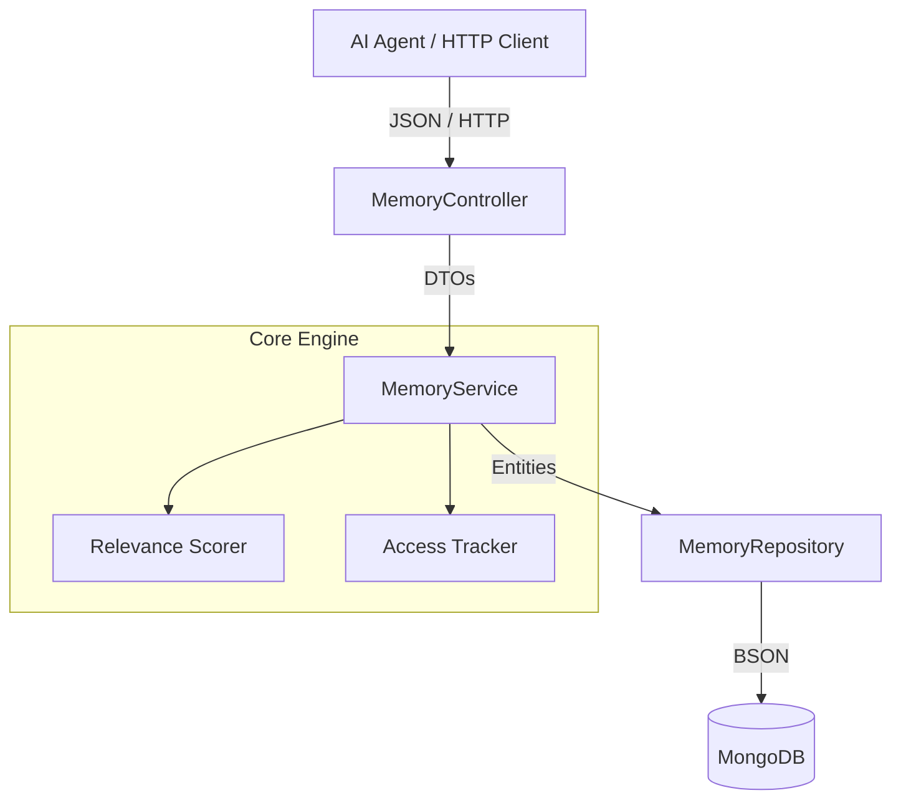

# 🧠 Memora — Intelligent Memory System for AI Agents

**Memora** é um microsserviço *stateless* que fornece memória contextual inteligente e persistência de histórico para agentes de Inteligência Artificial. Em vez de despejar dados brutos ou fazer consultas puramente sequenciais, o serviço avalia o **contexto em tempo de execução**, combinando importância atribuída, frequência de uso e recência (com decaimento temporal), para entregar apenas o que é relevante no momento certo.

Isso resolve um problema comum em agentes de IA: **janelas de contexto limitadas**. Ao priorizar as memórias mais relevantes em vez de retornar tudo, o Memora ajuda agentes a manter respostas coerentes e personalizadas sem sobrecarregar o modelo com informação desnecessária.

---

## ✨ Funcionalidades

- 📥 **Registro de memórias** por usuário, com tipo e nível de importância
- 🔍 **Consulta inteligente** ordenada por relevância (não apenas por data)
- 📈 **Rastreamento automático de acesso** — cada leitura atualiza contador e timestamp
- 🧮 **Score de relevância dinâmico**, combinando importância, frequência e recência
- 🗂️ **Filtros por tipo de memória** (ex.: preferências, fatos, eventos)
- 🐳 **Totalmente containerizado** com Docker e Docker Compose
- ✅ **Cobertura de testes unitários** isolados com JUnit 5 e Mockito

---

## 🏗️ Arquitetura

O serviço segue um padrão em camadas desacopladas, garantindo isolamento das regras de domínio, DTOs imutáveis e testes unitários sem dependências externas.



| Camada | Responsabilidade |
|---|---|
| **Controller** | Expõe os endpoints REST e valida requisições |
| **Service** | Orquestra regras de negócio, cálculo de score e rastreamento de acesso |
| **Repository** | Abstrai a persistência das memórias no MongoDB |
| **Relevance Scorer** | Calcula dinamicamente a pontuação de cada memória |
| **Access Tracker** | Atualiza contador de acessos e o timestamp de última leitura |

---

## 🧮 Algoritmo de Relevância

Para priorizar memórias essenciais sem estourar a janela de contexto dos modelos de linguagem, o Memora calcula um score dinâmico:

```
Score = Importância Base + (accessCount × 0.5) + Peso de Recência
```

| Componente | Regra |
|---|---|
| **Importância Base** | Escala de `1` a `10`, definida na criação ou atualização |
| **Frequência** | Cada consulta unitária incrementa o contador de acesso |
| **Recência** | Bônus de acordo com o último acesso: |
| | `< 24h` → **+3.0** |
| | `< 7 dias (168h)` → **+1.5** |
| | `> 7 dias` → **+0.0** |

Assim, memórias importantes, acessadas com frequência e recentemente consultadas sobem naturalmente na lista de relevância.

---

## 🚀 Tecnologias

| Categoria | Stack |
|---|---|
| Linguagem / Framework | Java 21 · Spring Boot 3 |
| Persistência | MongoDB (NoSQL orientado a documentos) |
| Testes | JUnit 5 · Mockito |
| Build | Maven |
| Utilitários | Lombok |
| Containerização | Docker · Docker Compose (multi-stage build) |

---

## 📡 Endpoints da API

| Método | Rota | Descrição | Status |
|---|---|---|---|
| `POST` | `/api/memories` | Registra uma nova memória | `201 Created` |
| `GET` | `/api/memories/{id}` | Busca por ID e rastreia o acesso | `200 OK` |
| `GET` | `/api/memories/user/{userId}` | Lista memórias do usuário (aceita filtro `?type=`) | `200 OK` |
| `GET` | `/api/memories/user/{userId}/relevant` | Recupera memórias ordenadas pelo score de relevância | `200 OK` |
| `PUT` | `/api/memories/{id}` | Atualiza conteúdo, importância ou tipo | `200 OK` |
| `DELETE` | `/api/memories/{id}` | Remove uma memória | `204 No Content` |

### Exemplo — Criando uma memória

**Requisição** `POST /api/memories`
```json
{
  "userId": "agent-user-01",
  "content": "O usuário prefere respostas estruturadas e testes no padrão AAA.",
  "type": "PREFERENCE",
  "importance": 9
}
```

**Resposta** `201 Created`
```json
{
  "id": "66d63cb535e6cf7b94921f01",
  "userId": "agent-user-01",
  "content": "O usuário prefere respostas estruturadas e testes no padrão AAA.",
  "type": "PREFERENCE",
  "importance": 9,
  "accessCount": 0,
  "createdAt": "2026-09-02T20:20:00",
  "lastAccessedAt": "2026-09-02T20:20:00"
}
```

**Erro de validação** `400 Bad Request`
```json
{
  "timestamp": "2026-09-02T20:21:10.123Z",
  "status": 400,
  "error": "Erro de validação de dados",
  "message": "Um ou mais campos contêm erros de validação.",
  "path": "/api/memories",
  "details": [
    "importance: O valor da importância deve estar entre 1 e 10"
  ]
}
```

---

## ⚙️ Como executar

### Pré-requisitos
- [Docker](https://www.docker.com/) e [Docker Compose](https://docs.docker.com/compose/) instalados
- (Opcional, para build local sem Docker) Java 21 e Maven

### Com Docker (recomendado)

```bash
# 1. Clone o repositório
git clone https://github.com/ElissonDouglas/Memora.git
cd Memora

# 2. Suba os containers da API e do MongoDB
docker compose up --build
```

A aplicação estará disponível em `http://localhost:8080`.

### Localmente com Maven

```bash
./mvnw spring-boot:run
```
> Certifique-se de ter uma instância do MongoDB acessível e configurada nas variáveis de ambiente/`application.properties` do projeto.

---

## 🧪 Testes

Para executar a suíte de testes unitários isolados (JUnit 5 + Mockito):

```bash
mvn test
```

---

## 🗺️ Roadmap

- [ ] Autenticação e autorização por API Key/JWT
- [ ] Suporte a expiração automática (TTL) de memórias de baixa relevância
- [ ] Endpoint de busca semântica (embeddings)
- [ ] Métricas e observabilidade (Prometheus/Grafana)
- [ ] Documentação interativa via Swagger/OpenAPI

---

## 🤝 Contribuindo

Contribuições são bem-vindas! Para contribuir:

1. Faça um fork do projeto
2. Crie uma branch para sua feature (`git checkout -b feature/minha-feature`)
3. Commit suas alterações (`git commit -m 'feat: minha nova feature'`)
4. Push para a branch (`git push origin feature/minha-feature`)
5. Abra um Pull Request

---

## 👤 Autor

Desenvolvido por [**Elisson Douglas**](https://github.com/ElissonDouglas).