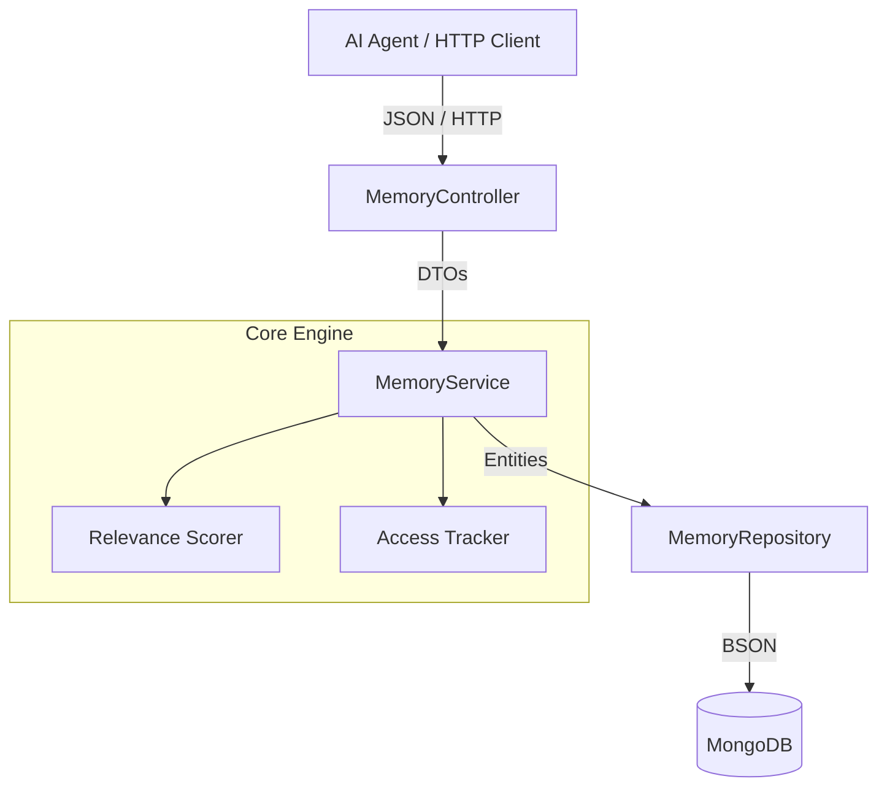

# Memora — Intelligent Context & Memory Service for AI Agents

O **Memora** é um microsserviço stateless projetado para fornecer memória contextual inteligente e persistência de histórico para agentes de inteligência artificial. Em vez de retornar um despejo bruto de dados ou consultas puramente sequenciais, o serviço avalia o contexto em tempo de execução combinando importância atribuída, frequência de uso e recência por decaimento temporal.

---

**Arquitetura do Sistema**

O serviço foi construído seguindo o padrão em camadas desacopladas, garantindo isolamento de regras de domínio, DTOs imutáveis e testes unitários sem dependência externa:



---

**Tecnologias Utilizadas**

* **Java 21** & **Spring Boot 3**
* **MongoDB** (Persistência NoSQL de documentos)
* **JUnit 5** & **Mockito** (Testes unitários isolados)
* **Docker** & **Docker Compose** (Containerização e multi-stage build)
* **Maven** & **Lombok**

---

**Algoritmo de Relevância**

Para priorizar memórias essenciais sem estourar a janela de contexto dos modelos de linguagem, o Memora calcula dinamicamente um score de relevância:

$$\text{Score} = \text{Importância Base} + (accessCount \times 0.5) + \text{Peso de Recência}$$

* **Importância Base:** Escala de $1$ a $10$ atribuída na criação ou atualização.
* **Frequência:** Cada consulta unitária incrementa o contador e atualiza o timestamp de acesso.
* **Recência:** Bônus ponderado conforme o último acesso:
* $< 24\text{ horas}$: $+3.0$
* $< 7\text{ dias}$ ($168\text{ horas}$): $+1.5$
* $> 7\text{ dias}$: $+0.0$


---

**Endpoints da API**

| Método | Rota | Descrição | Status HTTP |
| --- | --- | --- | --- |
| `POST` | `/api/memories` | Registra uma nova memória | `201 Created` |
| `GET` | `/api/memories/{id}` | Busca por ID e rastreia acesso | `200 OK` |
| `GET` | `/api/memories/user/{userId}` | Lista memórias do usuário (suporta filtro `?type=`) | `200 OK` |
| `GET` | `/api/memories/user/{userId}/relevant` | Recupera memórias ordenadas pelo score | `200 OK` |
| `PUT` | `/api/memories/{id}` | Atualiza conteúdo, importância ou tipo | `200 OK` |
| `DELETE` | `/api/memories/{id}` | Remove uma memória | `204 No Content` |

---

**Exemplos de Payloads**

* **Criação (`POST /api/memories`)**

```json
{
  "userId": "agent-user-01",
  "content": "O usuário prefere respostas estruturadas e testes no padrão AAA.",
  "type": "PREFERENCE",
  "importance": 9
}

```

* **Resposta de Sucesso (`201 Created`)**

```json
{
  "id": "66d63cb535e6cf7b94921f01",
  "userId": "agent-user-01",
  "content": "O usuário prefere respostas estruturadas e testes no padrão AAA.",
  "type": "PREFERENCE",
  "importance": 9,
  "accessCount": 0,
  "createdAt": "2026-09-02T20:20:00",
  "lastAccessedAt": "2026-09-02T20:20:00"
}

```

* **Resposta de Erro de Validação (`400 Bad Request`)**

```json
{
  "timestamp": "2026-09-02T20:21:10.123Z",
  "status": 400,
  "error": "Erro de validação de dados",
  "message": "Um ou mais campos contêm erros de validação.",
  "path": "/api/memories",
  "details": [
    "importance: O valor da importância deve estar entre 1 e 10"
  ]
}

```

---

**Execução com Docker**

Pré-requisito: ter o Docker e o Docker Compose instalados.

1. Clone o repositório:

```bash
git clone https://github.com/ElissonDouglas/memora.git
cd memora

```

2. Suba os containers da API e do MongoDB:

```bash
docker compose up --build

```

A aplicação estará disponível em `http://localhost:8080`.

---

**Executando Testes Unitários**

Para rodar a suíte de testes unitários isolados com Mockito:

```bash
mvn test

```

